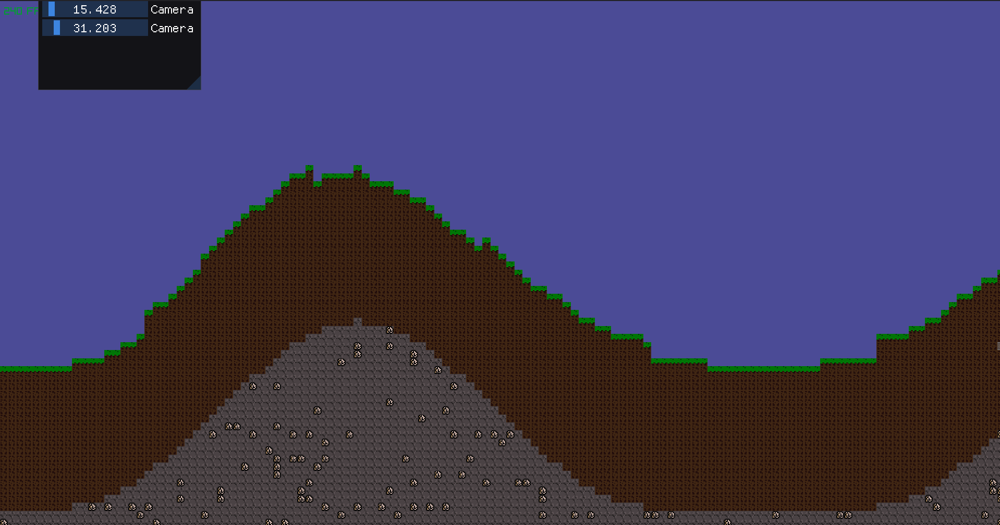
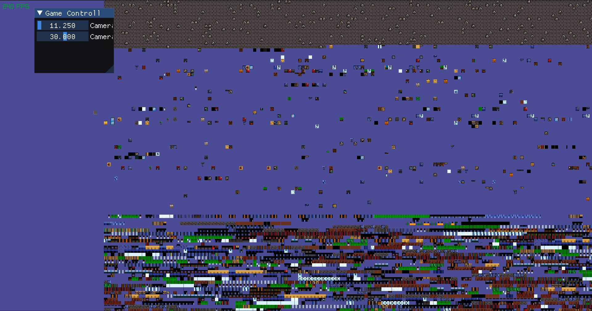
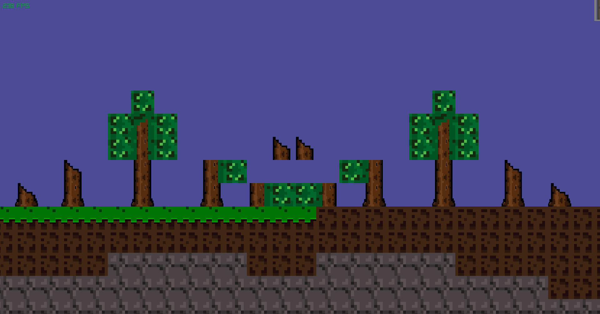

# C++ Project
This project is desing to push me to learn more about C++ by creating a large game based on Terraria.

## Things to add
- [ ] Make background tiles
- [ ] Alow for differnt tree types 

## Logs
## 2026_05_23: Map Generator useing sin wave
 

## 2026_05_23: Drawing Error Fixed
There was a error when drawing the map. Map width was given insted of hight causing it to render out of bounds 
 

### 2026_05_23: Random blocks 
Random Number generator used to desied block type based on location

### 2026_05_16 Dynamic Tree Logs 
Based on where logs are placed they will change type as shown below.
 

### 2026_05_13: Block Placement
With this project I'm currently at the stage of making the map and tile placement system, as shown below.

 

